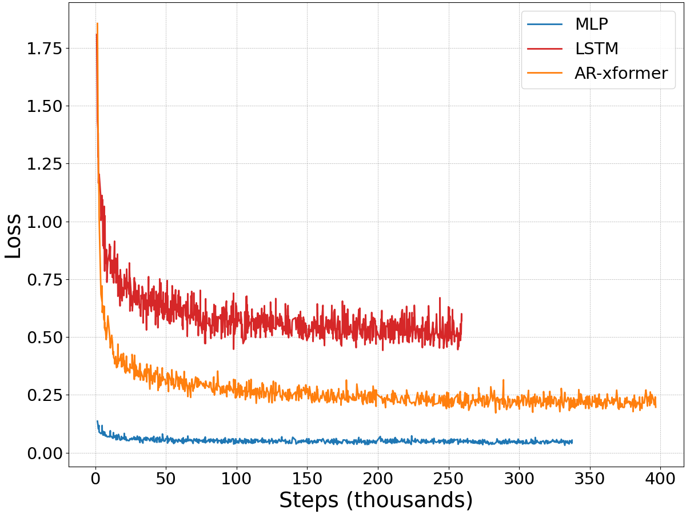

# Behavior Cloning with Transformers

This is an ongoing experiment to explore and evaluate different neural network architectures for behavior cloning on a 2D manipulation task from the [x-MAGICAL](https://github.com/kevinzakka/x-magical) benchmark.

## Environment and Dataset

A robotic gripper agent is tasked with sweeping 3 square debris into the goal zone at the top of the screen.


* We'll be using states instead of images for our observation space. The state is a 51-dimensional vector composed of a stack of 2 previous states plus the current state. It contains information like the position of the agent, its orientation, the width of the gripper, the position of the 3 debris, their distance to the agent and their distance to the goal zone (17 x 3 floats).
* The gripper agent has a 3D continuous action space (forward/backward, direction, open/close gripper).
* The evaluation score is the fraction of debris swept into the goal zone, and varies between 0 and 1. For example, if one debris has been swept into the pink zone, the score is 0.33.

1000 expert demonstrations are generated by training a policy with SAC for 500k timesteps with a handcrafted reward and then rolling it out in the environment and saving successful episodes.

## Policies

**MLP**.

When training Multi-Layer Perceptron (MLP) policies for BC, we treat our dataset of expert demonstrations as one big blob of iid (state, action) pairs. Training simply amounts to performing supervised learning on this blob, with the goal of learning a mapping from states to actions that minimizes a surrogate loss measuring how well our mapping mimics the expert policy. In our setting, the action space is continuous, so we can view the problem as one of regression and minimize the mean squared error (MSE) loss.

**Implementation.** Our MLP policy has 3 linear layers with a hidden size of 128 and dropout of 0.1. It contains ~24k total parameters.

```python
+----------------+------------+
|    Modules     | Parameters |
+----------------+------------+
| trunk.0.weight |    6528    |
|  trunk.0.bias  |    128     |
| trunk.3.weight |   16384    |
|  trunk.3.bias  |    128     |
| trunk.6.weight |    384     |
|  trunk.6.bias  |     3      |
+----------------+------------+
Total Trainable Params: 23,555
```

**LSTM**.

When training recurrent policies like an LSTM, we preserve the sequential nature of our expert demonstrations. Specifically, our dataloader samples full-length trajectories or slices of these trajectories unlike the IID assumption for the MLP. Thus, recurrent policies like the LSTM can leverage a history of past observations to make a prediction for the current timestep.

There's different subtle ways in which we can train recurrent policies. Sutskever's thesis [2] is a great background read. We considered two scenarios for our setup:

* We can enforce a batch size of 1. Our dataloader then loads an entire episode and feeds that into the LSTM. To deal with potentially very long trajectory lengths, we can use truncated backprop through time with an aptly chosen value of k. This is what is done in [1].
* We can choose to slice our trajectories, treating each slice as a separate training case. Our dataloader can randomly sample a start index in a trajectory and then sample until the end of the sequence, potentially enforcing some minimum sequence length. We can then pad these variable length sequences to fit them into a fixed-size batch and feed them into the LSTM. Alternatively, we can force the dataloader to always sample slices of fixed length and eliminate the need for padding -- in fact, note the default padding value of 0 may not always be the best choice for your data.

We tried both methods above and the latter with fixed-size sampling did the best.

**Implementation.** Our LSTM policy is composed on an MLP base followed by layer normalization, followed by a two-layer LSTM and final projection head. It contains ~27k parameters.

```python
+-------------------+------------+
|      Modules      | Parameters |
+-------------------+------------+
|    mlp.0.weight   |    3264    |
|     mlp.0.bias    |     64     |
|    mlp.3.weight   |    4096    |
|     mlp.3.bias    |     64     |
|    mlp.6.weight   |    2048    |
|     mlp.6.bias    |     32     |
|    norm.weight    |     32     |
|     norm.bias     |     32     |
| lstm.weight_ih_l0 |    4096    |
| lstm.weight_hh_l0 |    4096    |
|  lstm.bias_ih_l0  |    128     |
|  lstm.bias_hh_l0  |    128     |
| lstm.weight_ih_l1 |    4096    |
| lstm.weight_hh_l1 |    4096    |
|  lstm.bias_ih_l1  |    128     |
|  lstm.bias_hh_l1  |    128     |
|    head.weight    |     96     |
|     head.bias     |     3      |
+-------------------+------------+
Total Trainable Params: 26,627
```

**Transformer**.

Let's try to formulate behavior cloning as sequence modeling of expert demonstrations. Specifically, we can take our sequences of states and actions and train an autoregressive generative policy with a GPT-like Transformer architecture and training objective [3].

Our trajectory data will simply be the sequence of states and actions encountered by the expert policy, e.g., `T_e = {s_0, a_0, s_1, a_1, ..., s_T, a_T}` and the GPT-model will be tasked with learning to generate such a trajectory. At test time, we'll condition on the initial state, execute the action, observe the next state, feed it back to the model and autoregressively generate the desired action sequence.

TODO: Architecture details and training setup.

## Results

Each policy is rolled out 1000 times in the environment. We report the mean, standard deviation and 95% confidence intervals.

|             | Mean Success | CI 95 Lower | CI 95 Upper | Std Dev. |
|-------------|--------------|-------------|-------------|----------|
| MLP         | 0.70         | 0.68        | 0.73        | 0.35     |
| LSTM        | 0.68         | 0.66        | 0.70        | 0.36     |
| Transformer | 0.47         | 0.45        | 0.49        | 0.37     |

And here are the loss and success curves:

<p align="center">


</p>

## Todos

- [ ] Dagger.
- [ ] Mixture Density Network output layer.

## Setup

We require Python 3.8 or higher and recommend using an [Anaconda](https://docs.anaconda.com/anaconda/install/) environment for installation.

The following instructions will walk you through the setup, tested on Ubuntu 20.04.2 LTS.

```bash
# Create and activate environment.
conda create -n bcformer python=3.8
conda activate bcformer

# Install pytorch and torchvision.
conda install pytorch==1.7.1 torchvision==0.8.2 cudatoolkit=10.1 -c pytorch

# Install dependencies.
pip install -r requirements.txt
```

## Usage

To train a 2-layer MLP policy with a hidden size of 128 and a dropout value of 0.1, run:

```bash
python train.py --experiment_name="test_mlp" \
    --config=config.py \
    --config.policy.type="mlp" \
    --config.policy.mlp.hidden_dim=128 \
    --config.policy.mlp.hidden_depth=2 \
    --config.policy.mlp.dropout_prob=0.1
```

You can then visualize the tensorboard logs in the results directory with `tensorboard --logdir results`.

## References

* [1] P. Florence, L. Manuelli, R. Tedrake. *Self-Supervised Correspondence in Visuomotor Policy Learning*, IEEE Robotics and Automation Letters, 2020.
* [2] I. Sutskever, *Training Recurrent Neural Networks*, 2013.
* [3] A. Radford, K. Narasimhan, T. Salimans, I. Sutskever. *Improving Language Understanding by Generative Pre-Training*, 2018.
