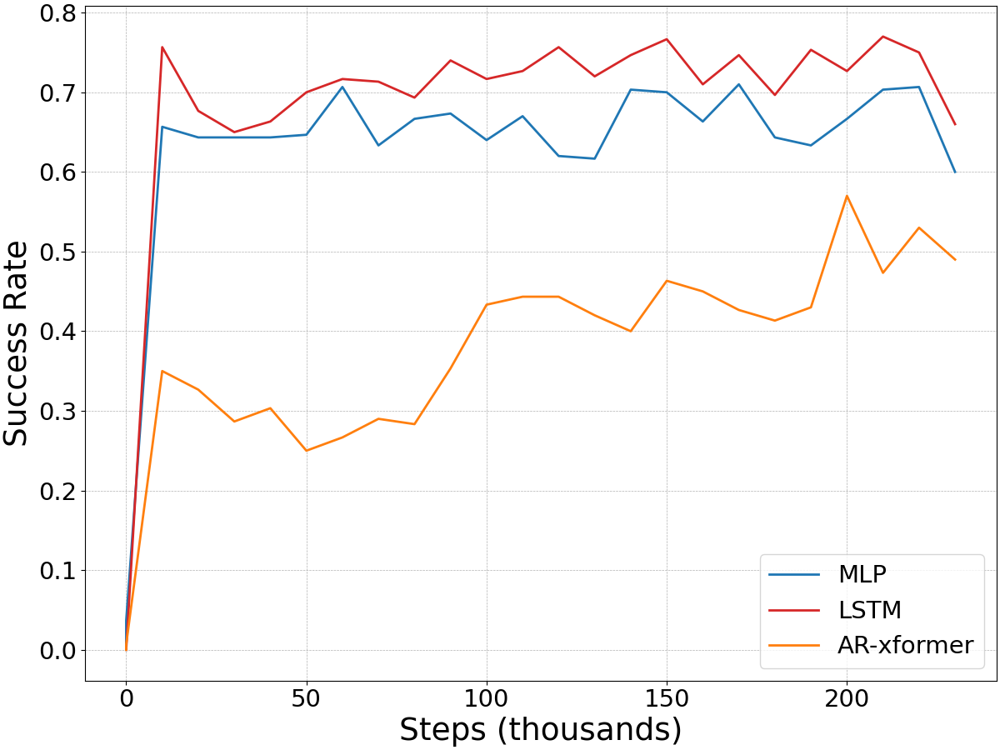

# Behavior Cloning with Transformers

In this project, we'd like to apply Transformers with self-attention to a Behavior Cloning setting and benchmark it against MLP and LSTM-based policies.

## Preliminary Results

Each policy is rolled out 1000 times in the environment. We report the mean, standard deviation and 95% confidence intervals.

|             | Mean Success | CI 95 Lower | CI 95 Upper | Std Dev. |
|-------------|--------------|-------------|-------------|----------|
| MLP         | 0.73         | 0.71        | 0.75        | 0.35     |
| LSTM        | 0.68         | 0.66        | 0.71        | 0.37     |
| Transformer |              |             |             |          |

And here are the loss and success curves:

<p align="center">


</p>

## Todos

- [ ] Dagger.
- [ ] Mixture Density Network output layer.

## Environment

We'll be using the [x-MAGICAL](https://github.com/kevinzakka/x-magical) environment, specifically focusing on the gripper agent in the sweeping task.


The gripper agent has a 3D continuous action space (forward/backward, direction, open/close gripper) and must sweep all 3 debris to the goal zone before time runs out. The evaluation score is the fraction of debris swept into the goal zone and varies between 0 and 1.

## Setup

We require Python 3.8 or higher. We recommend using an [Anaconda](https://docs.anaconda.com/anaconda/install/) environment for installation. The following instructions will walk you through the setup, tested on Ubuntu 20.04.2 LTS.

```bash
# Create and activate environment.
conda create -n bcformer python=3.8
conda activate bcformer

# Install pytorch and torchvision.
conda install pytorch==1.7.1 torchvision==0.8.2 cudatoolkit=10.1 -c pytorch

# Install dependencies.
pip install -r requirements.txt

# Install the x-MAGICAL benchmark.
git clone https://github.com/kevinzakka/x-magical.git
cd x-magical
pip install -e .
```

## Expert Dataset

1000 expert demonstrations are generated by training a policy with SAC. I'll add more details here later.

## Usage

To train a 2-layer MLP policy with a hidden size of 128 and a dropout value of 0.1, run:

```bash
python train.py --experiment_name="mlp_policy" \
    --config=config.py \
    --config.policy.type="mlp" \
    --config.policy.mlp.hidden_dim=128 \
    --config.policy.mlp.hidden_depth=2 \
    --config.policy.mlp.dropout_prob=0.1
```

You can then visualize the tensorboard logs in the results directory as follows:

```bash
tensorboard --logdir results/
```
